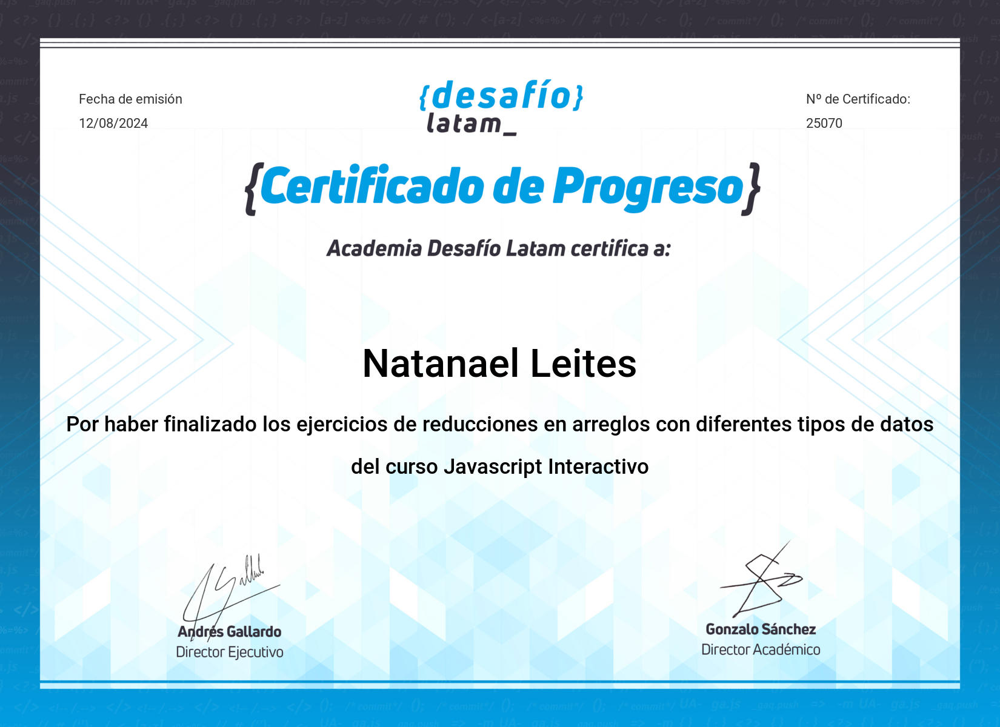
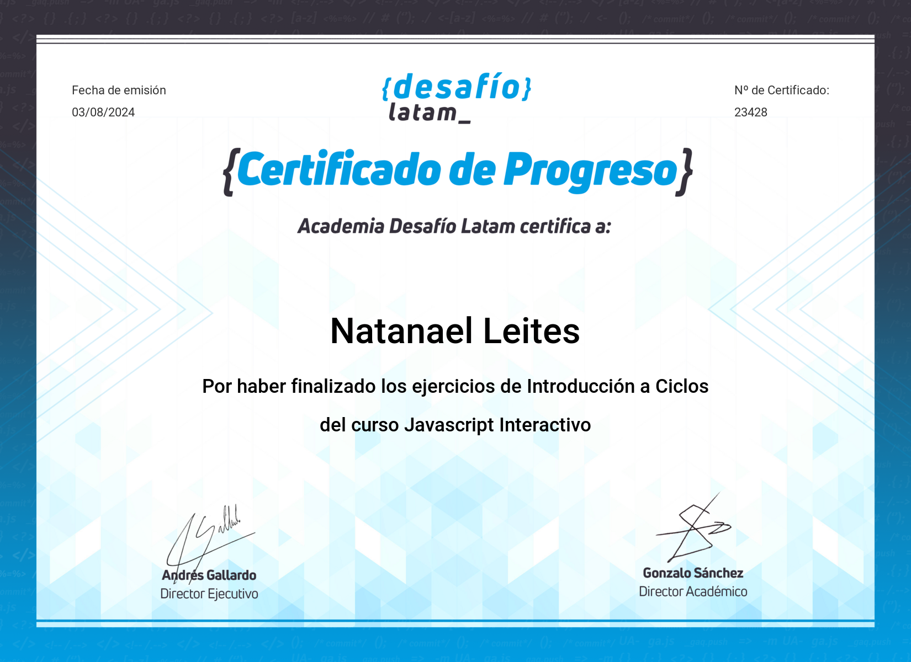
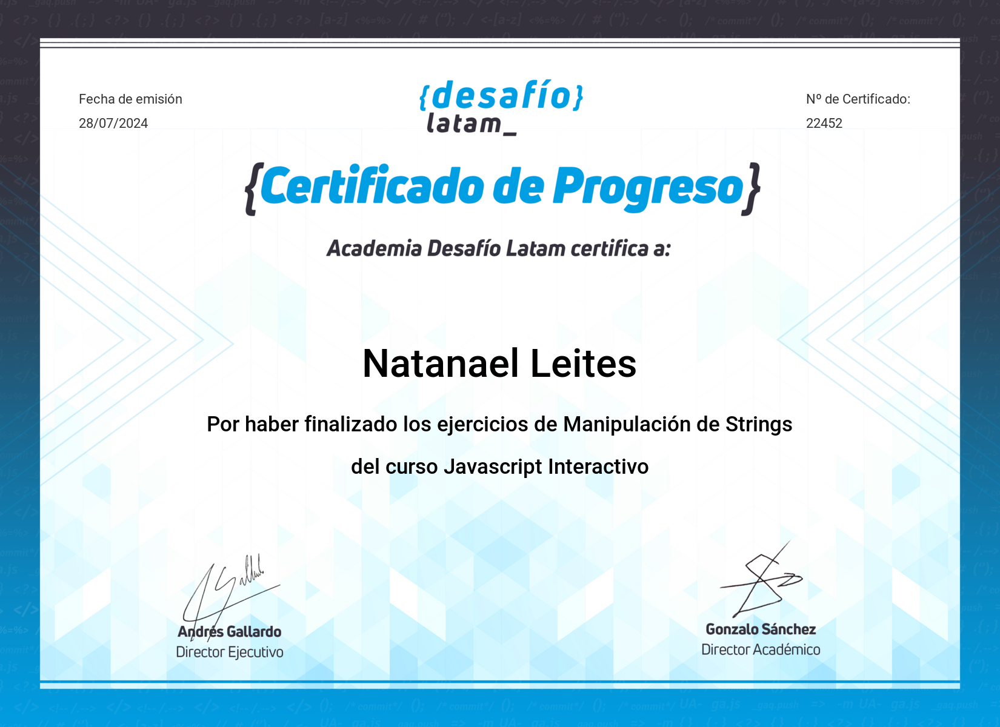
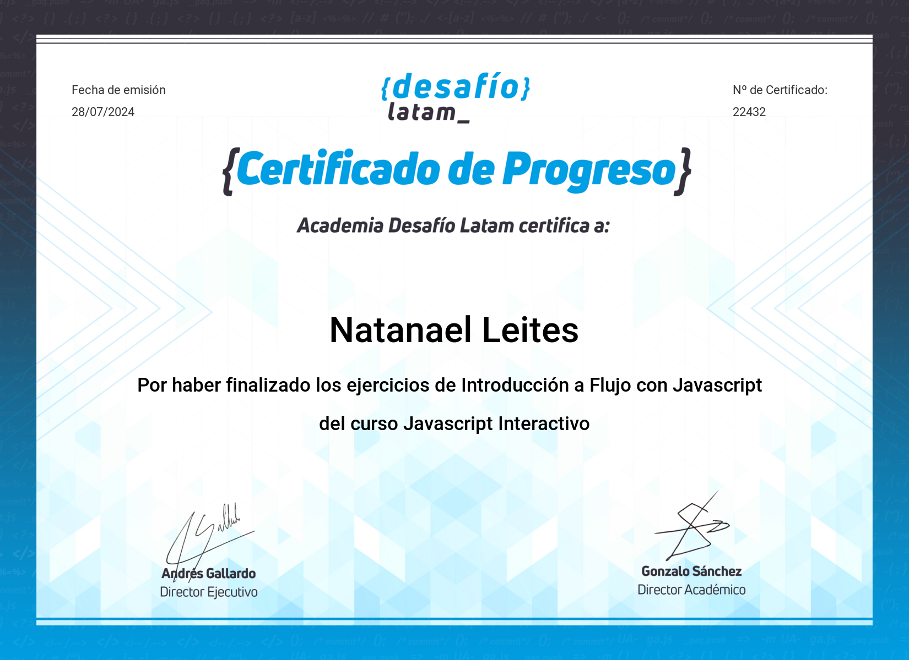
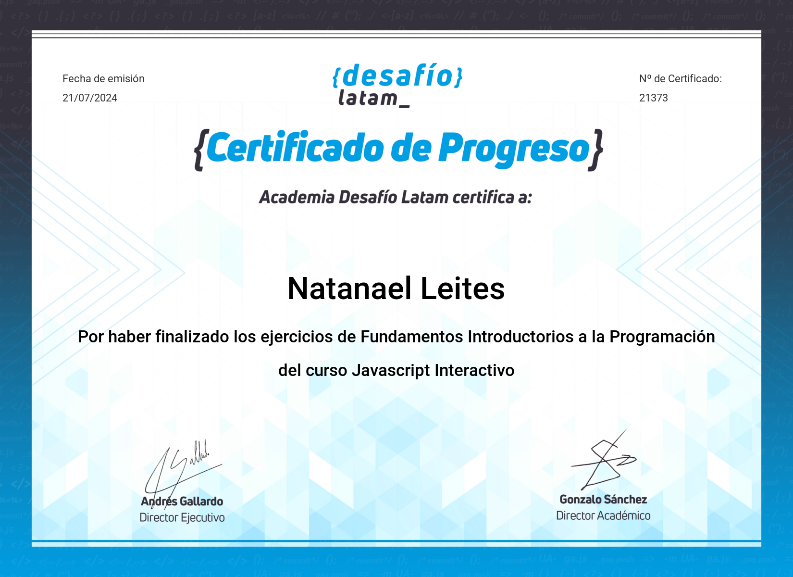

# Certificaciones
## [Reducciones, filtros y transformaciones Javascript]

**Desafio Latam**  
Fecha de obtención: 12/08/2024

## [Introduccion a ciclos Javascript]

**Desafio Latam**  
Fecha de obtención: 03/08/2024

## [Introduccion a arreglos Javascript]

**Desafio Latam**  
Fecha de obtención: 29/07/2024

## [Manipulacion de strings Javascript]

**Desafio Latam**  
Fecha de obtención: 28/07/2024

Certificaciones de Estudios
## [Flujos Javascript]

**Desafio Latam**  
Fecha de obtención: 28/07/2024

## [Fundamentos Javascript]

**Desafio Latam**  
Fecha de obtención: 21/07/2024

## 

**No Country**  
Fecha de obtención: 05/2024

## [Contexto Scrum]

**Academia Agil**  
Fecha de obtención: 27/04/2024

## [Desarrollador Javascript]

**CoderHouse**  
Fecha de obtención: 12/01/2023

## [Desarrollador web]

**CoderHouse**  
Fecha de obtención: 27/10/2022

## 

**Google Activate**  
Fecha de obtención: 15/7/2021
